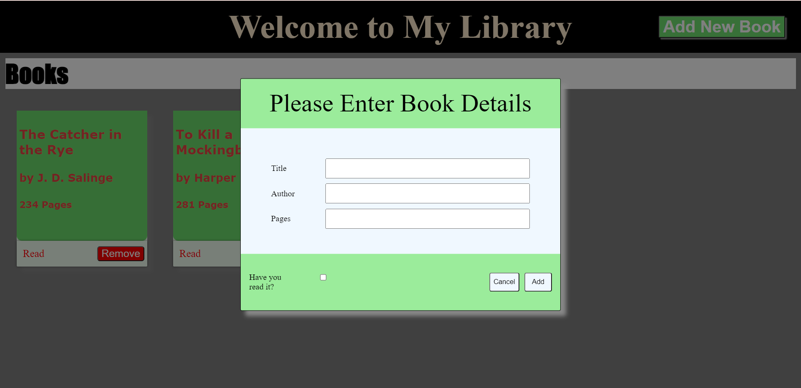

# Library
Users can add and remove books from the library. They can also change the read status of a book. 

Deployed Linkk: https://aayushkshrivastava.github.io/library/

## My Contribution and Learnings
 I wrote the HTML, CSS, and JavaScript code for this project. I used DOM Manipulation to add new books cards to the app. I leaned to work with JavaScript object constructors, and display a pop up form when the "Add New Book" button is clicked. 